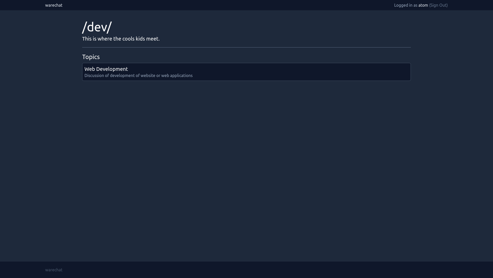
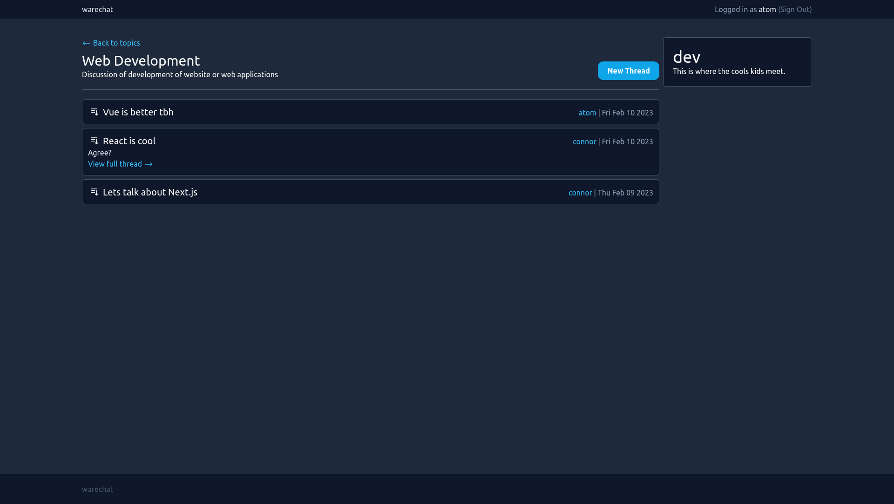
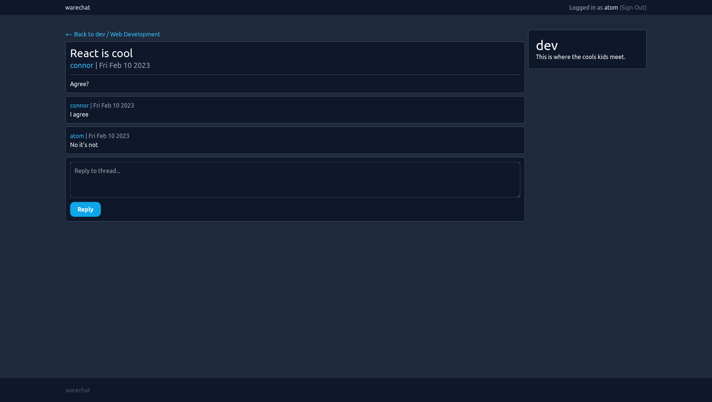

# About
Warechat is a forum website.

- A new user can sign up for a warechat account using their username, email, and password.
- Users can create threads on forums and reply to existing threads.
- Authors of posts and forum moderators can delete posts.
- Users can follow forums and see the latest threads from followed forums on their home page.







# Stack
- React.js, TailwindCSS
- Next.js, NextAuth, Prisma
- PostgreSQL

Written in TypeScript.

# Requirements

## PostgresSQL
Requires a PostgreSQL database with the schema defined in `/src/db/schema.sql`.

## Environment variables
Requires the following environment variables (e.g. in a `.env` file).

For PostgreSQL connection (via Prisma):
```
PG_URL=
```

For NextAuth configuration:
```
NEXTAUTH_URL="http://localhost:3000"
NEXTAUTH_SECRET=
```
More info on `NEXTAUTH_SECRET` [here](https://next-auth.js.org/configuration/options#secret).


## Setting up Prisma
```bash
npx prisma db pull
npx prisma generate
```


# Development

Check/run the PostgreSQL service:

```bash
sudo systemctl status postgresql
sudo systemctl start postgresql
```

Run the development server:

```bash
npm run dev
```

Hosted at [http://localhost:3000](http://localhost:3000) by default.
